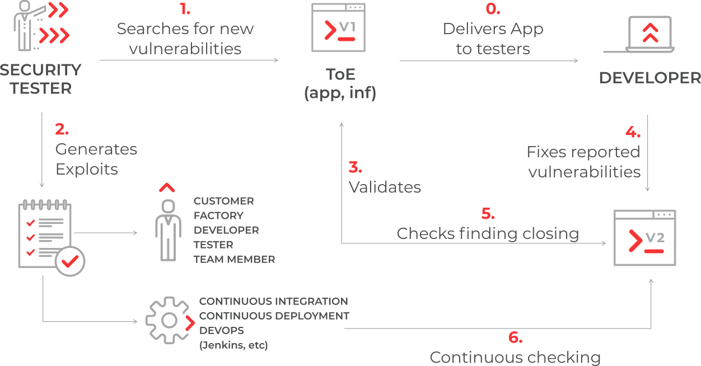

.. toctree::
   :hidden:
   :maxdepth: 1
   :caption: Navigation

   Home <self>
   qstart
   reqs
   install
   usage
   ref
   dev
   credits

========================================
Welcome to Fluid Asserts's documentation!
========================================

``Fluid Asserts`` is an engine
to automate the closing of security findings
over execution environments.
``Asserts`` performs Dynamic and Static
Application Security Testing
(`DAST <https://www.techopedia.com/definition/30958/dynamic-application-security-testing-dast>`_ and
`SAST <https://www.owasp.org/index.php/Source_Code_Analysis_Tools>`_) and
dynamic testing of many protocols (DXST).

``Asserts`` reuses previously handcrafted
attack vectors in order to
automate the closing of vulnerabilities.
This makes it particularly useful
since this testing can be performed by end users as-is
or as part of a continuous integration pipeline.
Thus any changes to the Target of Evaluation (``ToE``)
can be continuously tested against
the closing of confirmed vulnerabilities.

========
Features
========

Here are some of the things ``Asserts`` can do for you:

* Determine the closed or open status of a known vulnerability.
* Perform routine, generic security tests, specially in combination with...
* **Continuous Integration**: ``Asserts`` fits into your ``CI`` pipeline
  to ensure your product is released with no open vulnerabilities.
* Helps ethical hackers in their daily activities by
  automating tasks.
* Detailed tracing: For every vulnerability check
  (both on ``SAST`` and ``DAST``),
  ``Asserts`` prints the ``ToE`` fingerprint,
  thus enabling clients to pinpoint
  the exact moment when the vulnerability appeared.

* Now easier to install than ever and thoroughly documented.

What kind of vulnerabilities can ``Asserts`` test?

* [*New in v18.6*]
  `Software composition analysis <https://fluidattacks.com/web/en/blog/stand-shoulders-giants/>`_
  (:mod:`SCA <.sca>`): Now ``Asserts`` searches your dependencies' package managers
  for reported vulnerabilites. Including
  :mod:`Bower <.bower>`, :mod:`Chocolatey <.chocolatey>`,
  :mod:`Maven <.maven>`, :mod:`NPM <.npm>`, :mod:`NuGet <.nuget>` and
  :mod:`PyPI <.pypi>`.
* :mod:`Operating System <fluidasserts.syst>` vulnerabilities:
  :mod:`Linux <.linux>` and :mod:`Windows Server <.win>`.
* :mod:`Code vulnerabilities <.lang>`:
  nine languages supported
  including proprietary (:mod:`C# <.csharp>`),
  open source (:mod:`Python <.python>`, :mod:`Java <.java>`,
  :mod:`Javascript <.javascript>` and :mod:`Typescript <.javascript>`),
  markup (:mod:`HTML <.html>`),
  legacy (:mod:`RPG <.rpgle>`),
  :mod:`web configuration files <.dotnetconfig>`
  and even the :mod:`Dockerfile <.docker>` syntax!
* :mod:`Formats <.format>`:
  ``Asserts`` test formats ranging
  from regular :mod:`text <.string>`
  to :mod:`CAPTCHAs <.captcha>`
  and :mod:`Cookies <.cookie>`,
  as well as :mod:`PDF files <.pdf>` and
  :mod:`X.509 <.x509>` certificates.
* :mod:`Protocols <fluidasserts.proto>`:
  The heart of ``Asserts``,
  since most vulnerabilities are network-borne.
  The main network protocols are covered:

  * :mod:`SSL <.ssl>` (:func:`Heartbleed <.has_heartbleed>`, :func:`POODLE <.has_poodle_sslv3>`, :func:`BEAST <.has_beast>`, :func:`BREACH <.has_breach>`)
  * :mod:`HTTP <.http>` (:func:`Cross-site scripting <.has_xss>`,
    :func:`Parameter Pollution <.has_hpp>`,
    :func:`User enumeration <.has_user_enumeration>`,
    :func:`Cross-site scripting <.has_xss>`,
    :func:`Brute forcing <.can_brute_force>`,
    :func:`Command injection <.has_command_injection>`)
  * :mod:`TCP <.tcp>` (:func:`Open ports <.is_port_open>`)
  * :mod:`LDAP <.ldap>` (:func:`Anonymous bind <.is_anonymous_bind_allowed>`)
  * :mod:`SSH <.ssh>` (:func:`CBC check <.is_cbc_used>`)
  * :mod:`DNS <.dns>` (:func:`Amplification attacks <.can_amplify>`)
  * :mod:`FTP <.ftp>` (:func:`Passwordless login <.user_without_password>`)
  * :mod:`REST <.rest>` (:func:`Empty requests <.accepts_empty_content_type>`)
  * :mod:`SMB <.smb>` (:func:`Directory listing <.smb.has_dirlisting>`)
  * :mod:`SMTP <.smtp>` (:func:`Visible banner <.smtp.is_version_visible>`)

As of |today|
``Asserts`` provides <CHECKS> checks
in the scenarios above.
Use the search box in the sidebar,
peruse the :ref:`genindex`
for a bird's eye view of all the checks,
or just dive into the :doc:`ref`.

===========
Usage data
===========

Fluid Asserts collects some user's data like
public IP address, operating system, Python version
and the name of the checks that you use.
We do this in order to analyze what are
the most common platforms and the most used functions.
This help us to develop more useful tests in a future.
You can disable the gathering of this information
setting an environment variable named “FA_NOTRACK”
and setting its value to “true”.
You can enable the tracking later
by deleting that environment variable
or changing its value to “false”.

Fluid Asserts does not collect sensitive data like
targets of evaluation (URLs, IPs) or
results of the tests.
